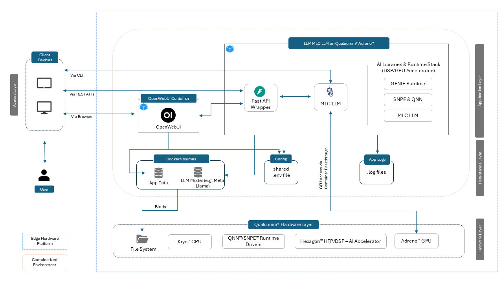


# LLM MLC LLM on Qualcomm® Adreno™

**Version:** 1.0

**Release Date:** Sep 2025

**Copyright:** © 2025 Advantech Corporation. All rights reserved.

---
## Overview

MLC LLM is a machine learning compiler and high-performance deployment engine for large language models. The mission of this project is to enable everyone to develop, optimize, and deploy AI models natively on everyone’s platforms. This section is a quick tutorial to introduce how to try out MLC LLM, and the steps to deploy **Meta Llama  3.2 1B** models with MLC LLM.

This solution utilizes **MLC-compiled LLMs** with **OpenCL acceleration** to run **Meta Llama 3.2 1B** efficiently on **Qualcomm® QCS6490™**

The containerized environment combines:

-  **MLC TVM runtime** for flexible deployment utilizing **GPU (OpenCL)**.

-  **FastAPI** wrapper for exposing an **OpenAI-compatible completions API**.

-  **OpenWebUI** for interactive chat experiences.

This setup is designed for **on-device, offline inference** — ensuring low-latency and privacy-preserving AI at the edge.

---  

## Key Features

| Feature | Description |
|---------|-------------|
| **MLC TVM Runtime** | Optimized compiler + runtime stack for running quantized models with GPU acceleration. |
| **OpenCL Support** | Runs LLM models on **Adreno GPU**. |
| **QNN & SNPE Acceleration** | Added support for execution of quantized models on Hexagon DSP v68. |
| **OpenWebUI** | Clean, browser-based interface for interactive chat. |
| **OpenAI-Compatible API** | REST API for `/chat/completions`, works with OpenWebUI, LangChain, etc. |
| **Streaming Output** | Real-time token-by-token streaming in both CLI and API. |
| **Offline Deployment** | Fully offline after container setup and model copy. |
| **Flexible Parameters** | Supports params like `temperature`, `top_p`, `repetition_penalty`, `frequency_penalty`, `presence_penalty`, `max_num_tokens`|

---  

## Architecture



---

## Hardware Specifications

| Component | Specification |
|-----------|---------------|
| **Device** | Advantech AOM-2721 |
| **SoC** | Qualcomm® QCS6490™ (soc_id-35) |
| **GPU** | Adreno™ 643 (OpenCL backend supported) |
| **DSP/HTP** | Hexagon™ 770 v68 with tensor accelerator |
| **Memory** | 8GB LPDDR5 |
---

## Operating System

This container is intended for **QCOM Robotics Reference Distro with ROS**, version **1.3-ver.1.1** OS running on QCS6490 device.

| Environment | OS |
|-------------|----|
| **Device Host** | QCOM Robotics Reference Distro with ROS 1.3-ver.1.1 |
| **Container** | Ubuntu 22.04 LTS |

---

## Software Components

| Component | Version | Description |
|-----------|---------|-------------|
| **MLC LLM Runtime** | 0.1.dev0 | Provides TVM-compiled LLM runtime for GPU/HTP |
| **Apache TVM** | 0.14+ | Compiler stack used by MLC to generate optimized kernels |
| **QNN SDK** | 2.32.0 | Qualcomm Neural Network runtime for quantized models |
| **SNPE** | 2.32.0 | Snapdragon Neural Processing Engine |

The following software components/packages are provided further as a part of this image:
| Component | Version | Description |
|-----------|---------|-------------|
| **Python** | 3.10.12 | For FastAPI + backend scripts |
| **FastAPI** | 0.116.1 | REST API server for OpenAI-compatible endpoints |
| **OpenWebUI** | 0.6.5 | Lightweight frontend for chat via seperate container |
| **Uvicorn** | Latest | ASGI server for FastAPI |

---
## Supported AI Capabilities

### LLM Models

| Model | Format | Notes |
|-------|--------|-------|
| Meta Llama 3.2 1B | `.bin` | Converted with MLC TVM |
| Meta Llama 3.2 3B | `.bin` | Converted with MLC TVM |

> **Note:** This is a non-exhaustive list of supported models that have been tested. There would be more models compatible with MLC TVM on QCS6490, and users are encouraged to explore further.

---

## Supported Model Formats

| Runtime | Format |
|---------|--------|
| MLC Runtime | `.bin` |
| QNN | `.bin` |
| SNPE | `.dlc` |

---
## Repository Structure
```
LLM-MLC-LLM-on-Qualcomm-Adreno/
├── .env                                    # Environment configuration
├── mlc_app.py                              # FastAPI wrapper built around MLC-Chat supporting OpenAI standard endpoints
├── Model_Conversion_Guide.md               # Instructions for converting models with MLC-TVM
├── efficient-prompting-for-compact-models.md   # Craft better prompts for small and quantized language models
├── README.md                               # Overview and quick start steps
├── build.sh                                # Build script
├── docker-compose.yml                      # Docker Compose setup
├── start_service.sh                        # Script to start MLC LLM API Service
├── windows-git-setup.md                    # Steps to fix LF/CRLF issues on windows while copying to device
├── data                                    # Contains subfolders for assets like images, gifs etc.              
└── wise-bench.sh                           # Script to verify acceleration and software stack inside container

```
  

## Container Description

`build.sh` launches the following containers:

-  **llm-mlc-llm-on-qualcomm-adreno** → Runs MLC runtime for hardware-accelerated inference using OpenCL.

-  **openweb-ui-service** → Web UI for chat interactions.


###  LLM-MLC-LLM-on-Qualcomm-Adreno Container Highlights

This container leverages the **MLC runtime** to efficiently execute large language models (LLMs) such as **Meta Llama 3.2 1B** on **Qualcomm® QCS6490™** devices. Built on the **Apache TVM compiler stack**, MLC provides a hardware-accelerated, container-friendly runtime that enables models to run seamlessly on-device via **OpenCL (GPU)** backend. Optimized for edge deployment, it ensures **real-time, low-latency inference** without reliance on cloud-based infrastructure.

| Feature | Description |
|---------|-------------|
| **Local Inference Engine** | The `mlc_cli_chat` tool is provided to run text-to-text inference on the compiled Llama 3.2 1B model. It accepts a user prompt and streams the generated response. |
| **OpenAI API Compatibility** | FastAPI backend exposes an OpenAI-compatible `/chat/completions` endpoint; works seamlessly with OpenWebUI. |
| **Streaming Output Support** | Supports real-time token-by-token streaming for chat UIs and API responses. |
| **Edge Optimized** | MLC-compiled models run efficiently on **Adreno GPU (OpenCL)**. |
| **Customizable Behavior** | Configure runtime parameters (e.g., `temperature`, `top_k`, `top_p`, `seed`, `max-num-tokens`) in model config JSON or via API. |
| **Prompt Engineering** | Supports structured prompts with system, user, and assistant roles. |
| **Offline-First** | Works fully offline after model conversion and deployment; no cloud dependency. |
| **Developer Friendly** | Simple CLI (`mlc_cli_chat`) and Dockerized setup for quick local experimentation. |
| **Easy Integration** | Backend-ready for FastAPI, OpenWebUI, and custom applications. |
| **AI Dev Environment** | Provides a full hardware-accelerated containerized environment for on-device LLM development and testing. |


### OpenWebUI Highlights
OpenWebUI serves as a lightweight, responsive frontend for interacting with LLMs deployed locally on the Qualcomm® QCS6490™ device. In this setup, it connects directly to the FastAPI wrapper for running the `mlc_llm chat` interface, which exposes an OpenAI-compatible endpoint powered by the Meta Llama 3.2 1B model. Containerizing OpenWebUI ensures a modular, browser-accessible deployment that delivers a seamless real-time chat experience without cloud dependency, fully optimized for on-device edge inference.

| Feature                          | Description |
|----------------------------------|-------------|
| **User-Friendly Interface**      | Sleek, chat-style UI for real-time interaction. |
| **OpenAI-Compatible Backend**    | Works with MLC, OpenAI, and similar APIs with minimal setup. |
| **Container-Ready Design**       | Lightweight and optimized for edge or cloud deployments. |
| **Streaming Support**            | Enables real-time response streaming for interactive UX. |
| **Authentication & Access Control** | Basic user management for secure access. |
| **Offline Operation**            | Runs fully offline with local backends like Ollama. |

---
## List of READMEs

| Module   | Link                | Description                     |
|----------|----------------------------|-------------------------------|
| Quick Start | [README](./README.md) | Overview of the container image   |
| Model Conversion | [README](./Model_Conversion_Guide.md) | Instructions for converting models with MLC-TVM|
| Prompt Guidelines | [README](./efficient-prompting-for-compact-models.md) | Guidelines to craft better prompts for small and quantized language models |
| Windows Git Line Ending Setup | [README](./windows-git-setup.md) | Steps to configure Git on Windows to handle LF/CRLF line endings correctly |
| SCP Troubleshooting Guide | [README](./scp-troubleshooting-guide.md) | Guidelines for troubleshooting issues related to SCP file transfers |

## Model Information

| Item | Value |
|------|-------|
| **Source** | MLC + TVM compiled `.bin` model (Meta Llama 3.2 1B) |
| **Architecture** | Llama 3.2 1B |
| **Quantization** | q4f16_0 (4-bit integers with FP16 scaling, using layout variant 0) |
| **Parameters** | ~1B |
| **Model size** | ~675 MB |
| **Context length** | 131072 |

---

## Quick Start Guide

> **Note:** Before starting this LLM container, ensure that no other LLM container is currently running or using the port specified in the .env file (e.g., 8000); otherwise, stop and remove the active container first. Only one LLM container should run at a time to prevent port conflicts.


### Clone the Repository (on your development machine)

> **Note for Windows Users:**  
> If you are using **Linux**, no changes are needed — LF line endings are used by default.  
> If you are on **Windows**, please follow the steps in [Windows Git Line Ending Setup](./windows-git-setup.md) before cloning to ensure scripts and configuration files work correctly on Device.

```bash
git clone https://github.com/Advantech-EdgeSync-Containers/LLM-MLC-LLM-on-Qualcomm-Adreno.git
cd LLM-MLC-LLM-on-Qualcomm-Adreno
```

### Transfer the `LLM-MLC-LLM-on-Qualcomm-Adreno` folder to QCS6490 device

If you cloned the repo on a **separate development machine**, use `scp` to transfer only the relevant folder (refer to [SCP Troubleshooting Guide](./scp-troubleshooting-guide.md) if any issues faced):

```bash
# From your development machine (Ubuntu or Windows PowerShell if SCP is installed)
scp -r .\LLM-MLC-LLM-on-Qualcomm-Adreno\ <username>@<qcs6490-ip>:/home/<username>/
```

Replace:

* `<username>` – Login username on the QCS6490 board (e.g., `root`)
* `<qcs6490-ip>` – IP address of the QCS6490 board (e.g., `192.168.1.42`)

This will copy the folder to `/home/<username>/LLM-MLC-LLM-on-Qualcomm-Adreno/`.

Then SSH into the Qualcomm® device:

```bash
ssh <username>@<qcs6490-ip>
cd ~/LLM-MLC-LLM-on-Qualcomm-Adreno
```

### Model Preparation

**Mandatory Pre-requisite:** Before executing the `build.sh` script, ensure that the **Meta Llama 3.2 1B model** and its associated runtime library are available in the `/model` directory of your **QCS6490 device**.

This step is **mandatory** for successful container deployment and inference.

#### Model Setup Options

You have two options to ensure the model files are correctly placed on the target device:

1.  **Convert the Model Using MLC-TVM**
2.  **Copy a Pre-Converted Model**

#### Option 1 — Convert the Model Using MLC-TVM

If the model is not yet converted for the MLC framework:

* Follow the detailed steps in the [Model_Conversion_Guide](./Model_Conversion_Guide.md) to generate the MLC-compatible model package.
* Once conversion is complete, **transfer the generated files** to your **QCS6490 target** under the project folder.

#### Option 2 — Copy a Pre-Converted Model

If you already have the converted model (or use this link to download pre-converted meta llama 3.2 1B model - [Download Model](https://advantecho365.sharepoint.com/:f:/r/sites/ContainerProject-Nagarro/Shared%20Documents/Nagarro%20Development/Qualcomm%20MLC%20LLM%20Models/MLC_LLM_Llama3.2_1B?csf=1&web=1&e=aQb9re)):

1.  **Create the model directory** on the target device (`QCS6490`).

    ```bash
    # On the target device (QCS6490)
    mkdir -p /home/root/LLM-MLC-LLM-on-Qualcomm-Adreno/model
    ```

2.  **Transfer both the model folder and the `.so` file** from your development machine using `scp`:

    ```bash
    # From your development machine
    scp -r Llama3.2_1B_model_params root@<target_ip>:/home/root/LLM-MLC-LLM-on-Qualcomm-Adreno/model/
    scp llama3.2-1b-instruct-q4f16_0-adreno-iot.so root@<target_ip>:/home/root/LLM-MLC-LLM-on-Qualcomm-Adreno/model/
    ```
### Installation

```bash
# Make the build script executable
chmod +x build.sh

# Launch the container
./build.sh
```
### AI Accelerator and Software Stack Verification (Optional)

#### Verify AI Accelerator and Software Stack Inside Docker Container
```bash
chmod +x wise-bench.sh
./wise-bench.sh
```


Wise-bench logs are saved in the `wise-bench.log` file under `/workspace`

### Run services

```bash
# Make the start service script executable
chmod +x start_services.sh
# Launch the start services
./start_services.sh
```

### Check Installation Status
Exit from the container and run following command to check the status of the containers:

```bash
docker ps
```

Allow some time for containers to become healthy.

### UI Access
Access OpenWebUI via any browser using the URL given below. Create an account and perform login:

```bash
http://localhost_or_QCS6490_IP:3000
```

### Quick Demonstration:


---
## Model Parameters Customization


The **MLC runtime** supports fine-tuning of runtime parameters such as `temperature`, `top-k`, `top-p`, `repetition_penalty`, `frequency_penalty`, `presence_penalty`, and maximum token length.  
These parameters can be configured in the **mlc_chat_config.json** file or passed dynamically through the API request.

By customizing these values, you can optimize the model for a wide range of use cases—from **deterministic outputs** for testing and reproducibility to **creative, diverse generations** for conversational AI.

Below is an example section from the `mlc_chat_config.json` file with tuned values for **better quality and reduced repetition**:

```bash
},
  "vocab_size": 128256,
  "context_window_size": 131072,
  ...
  "temperature": 0.8,
  "top_p": 0.9,
  "repetition_penalty": 1.15,
  "frequency_penalty": 0.7,
  "presence_penalty": 0.5
  "tokenizer_files": [
    "tokenizer.json",
    "tokenizer_config.json"
  ],
  ...
````

## Prompt Guidelines

This [README](./efficient-prompting-for-compact-models.md) provides essential prompt guidelines to help you get accurate and reliable outputs from small and quantized language models.

## MLC LLM Logs and Troubleshooting

### Log Files

The MLC LLM engine provides an option to enable event logging for requests, which can be useful for debugging and monitoring. You can enable tracing with the `--enable-tracing` argument for more advanced logging user can enable this. Currently we are logging api service logs in below files: 

| Log File | Description |
|-----------|---------|
| uvicorn.pid | Provides process-id for the currently running uvicorn service   |
| uvicorn.log | Provides uvicorn service logs |
  
### Troubleshoot

Here are quick commands/instructions to troubleshoot issues with running a model using **`mlc llm`**  ,**`mlc_cli_chat`**, *FastAPI*, *uvicorn* and *OpenWebUI*:

- View uvicorn service logs within the container
  ```bash
  tail -f uvicorn.log
  ```
- Make sure that you are in `mlc-venv` environment if not then use below command to activate the `mlc-venv`.
   ```bash
   conda activate mlc-venv
   ```
- Verify that the model and all its dependencies are available for `mlc llm`. Ensure the model is loaded correctly for execution using the `mlc`. Run the following command inside the Docker container.    
  ```bash
  mlc_llm serve --help
  ```

- If MLC Model is not running then check the Environment Variables
  ```bash
  echo $MLC_MODEL_PATH
  echo $MODEL_LIB
  ```
  These should match with the following as per the converted model files path:
  ```bash
  MLC_MODEL_PATH=/workspace/model/Llama3.2_1B_model_params
  MODEL_LIB=/workspace/model/llama-3.2-1b-instruct-q4f16_0-adreno-iot.so
  ```
- Verify that the model directory contains all required files in the correct folder structure — such as the MLC Chat Config file, tokenizer configuration file, and the tokenizer JSON file. Below is a reference example of the files typically found inside the model folder.
   ```bash
   (mlc-venv) root@qcs6490aom2721a1:/workspace/model Llama3.2_1B_model_params# ls
   mlc-chat-config.json  params_shard_1.bin   params_shard_12.bin  params_shard_15.bin params_shard_18.bin  params_shard_20.bin
   params_shard_4.bin  params_shard_7.bin tokenizer.json ndarray-cache.json    params_shard_10.bin  params_shard_13.bin 
   params_shard_16.bin  params_shard_19.bin  params_shard_21.bin  params_shard_5.bin params_shard_8.bin  tokenizer_config.json
   params_shard_0.bin  params_shard_11.bin params_shard_14.bin  params_shard_17.bin  params_shard_2.bin params_shard_3.bin
   params_shard_6.bin  params_shard_9.bin
  ```

- If OpenWebUI chat is not returning a response, use the following `curl` command to test the API directly. If the response shows an error message (e.g., model file or lib missing or any other error), take the necessary action based on the error.
  ```bash
  curl -X POST \
  -H "Content-Type: application/json" \
  -d '{
        "model": "/workspace/model/Llama3.2_1B_model_params",
        "messages": [
            {"role": "user", "content": "What is the capital of France?"}
        ],
       "stream": false
  }' \
  http://192.168.29.121:8000/v1/chat/completions
  ```

- Kill & restart services within container (check pid manually via `ps -eaf` or use pid stored in `uvicorn.pid`)
  ```bash
  kill $(cat uvicorn.pid)
  ./start_services.sh
  ```

  Confirm there is no  service running using:
  ```bash
  ps -eaf
  ```
  
## MLC LLM CLI Inference Sample

Here's a simple CLI example for running inference using `mlc_cli_chat`. This command invokes the MLC LLM engine to execute the **Meta Llama 3.2 1B** model using a specified model, library file and device (OpenCL) , followed by a user-defined prompt.

Inside the container `/workspace/mlc-llm/build/apps/mlc_cli_chat/`
```bash
./mlc_cli_chat --model /workspace/model/Llama3.2_1B_model_params/ --model-lib /workspace/model/llama3.2-1b-instruct-q4f16_0-adreno-iot.so --device  opencl --with-prompt  "What is the capital of France"
```
sample output:


this command will invoke a `mlc cli chat` application using `OpenCL` for `GPU` backend and provide user and chat interface for inference. 
For more details user can run below command:
```bash
./mlc_cli_chat --help
``` 
sample output:


user can also check the model inference stats using the `/stats` in the mlc cli chat terminal 

---

## Best Practices and Recommendations

### Memory Management & Speed (MLC LLM on QCS6490)

- **Model Placement**: Ensure models are fully loaded into the DSP/HTP memory or GPU VRAM for optimal inference performance.
- **Batch Inference**: Use batch inference when running multiple requests to improve throughput efficiency.
- **Dynamic Memory Offloading**: Offload unused models from DSP/HTP/GPU memory when not needed to free up resources for active workloads.
- **Quantization Preference**: Prefer quantized models (e.g., **INT8, Q4F16**) to balance **speed, memory usage, and accuracy**.
- **Context Length Tuning**: Reduce the maximum context length when possible to minimize  memory usage without impacting task quality.
- **Token Management**: override `max_tokens` to avoid unnecessarily long generations that increase latency and memory consumption.
- **Model Size Guidance**: For best performance on **QCS6490**, use models with **≤3B parameters**.

## REST API Access

If you’ve launched the **FastAPI backend** inside the container (`./start_services.sh`), you can call it with `curl`:

Inference Request:
```bash
curl -X POST \
  -H "Content-Type: application/json" \
  -d '{
        "model": "/workspace/model/Llama3.2_1B_model_params",
        "messages": [
            {"role": "user", "content": "What is the capital of France?"}
        ],
       "stream": false
  }' \
  http://192.168.29.121:8000/v1/chat/completions
`````

Here stream mode could be changed as true/false as per the needs.

Response:
```bash
{"id":"chatcmpl-c36344de9e30405f814bb6bc71cf4b6b","choices":[{"finish_reason":"stop","index":0,"message":{"content":"The capital of France is Paris.","role":"assistant","name":null,"tool_calls":null,"tool_call_id":null},"logprobs":null}],"created":1758198358,"model":"/workspace/model/Llama3.2_1B_model_params","system_fingerprint":"","object":"chat.completion","usage":{"prompt_tokens":32,"completion_tokens":8,"total_tokens":40,"extra":null}}
```

Sample Screenshot:


---

## Known Limitations

1. **OpenWebUI Dependencies**  
   On the first startup, OpenWebUI installs certain dependencies. These are persisted in the associated Docker volume, so allow some time for this **one-time setup** to complete before use.

2. **Model Compilation**  
   Models must be explicitly converted for execution. Always verify the **quantization format** and **device compatibility** before running a model.

3. **Model Size Restrictions**  
   Models larger than **1B parameters** may not run efficiently on QCS6490 due to memory constraints. GPU execution is possible but may suffer from latency or thermal throttling.

4. **Context Length Limitations**  
   Very long context lengths can exceed memory limits, leading to errors or performance degradation. Adjust `max_tokens` and context size accordingly.

5. **Docker Storage Constraints**  
   Running inside Docker containers can quickly consume disk space due to model weights, logs, and cache. Ensure sufficient storage is available on the device.

6. **Streaming Support**  
   While streaming improves responsiveness, it can cause higher memory pressure if multiple clients are connected simultaneously.
  

## Possible Use Cases

Leverage this container image to build powerful, on-device AI applications with **MLC LLM**, **FastAPI**, and **OpenWebUI**:

- **Private LLM Inference on Local Devices**  
  Run large language models entirely on the QCS6490 without internet access — ideal for privacy-critical and air-gapped environments.

- **Lightweight Backend for LLM APIs**  
  Use the FastAPI backend to expose Phi2-2.7B locally for integration with tools like LangChain, custom UIs, or automation scripts.

- **Multilingual Assistants**  
  Deploy multilingual conversational agents that translate, summarize, or interact in multiple languages — all running locally on QCS6490.

- **LLM Evaluation and Benchmarking**  
  Swap and test different quantized models (Q4/Q8) to compare performance, accuracy, and DSP utilization directly on QCS6490 hardware.

- **Custom Offline Agents**  
  Build fully offline intelligent agents powered by `genie-t2t-run` that can interact with local tools (e.g., databases, APIs, sensors, MQTT endpoints) for decision-making at the edge.

- **Edge AI for Industrial Applications**  
  Deploy on QCS6490 to enable natural language interfaces, command parsing, or decision-support tools at the edge for IoT, manufacturing, or embedded control systems.  

---

Copyright © 2025 Advantech Corporation. All rights reserved.
